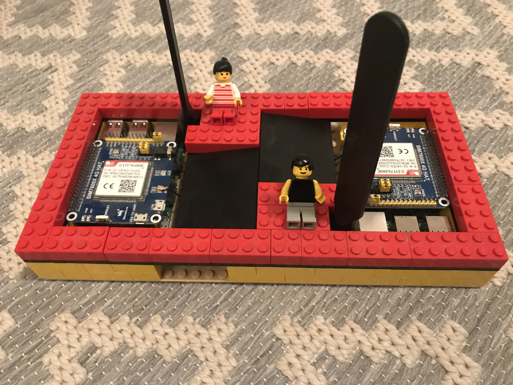
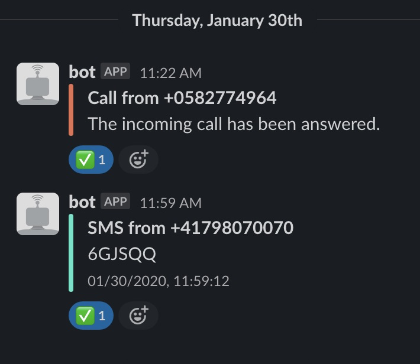

# Smack

📲 Forward SMS and calls from any SIM card to Slack.

## Motivation

Built this after I recieved an expensive bill because a service I used only offered two factor authentication via SMS and my phone mysteriously downloaded a couple of megabytes while roaming in Asia. 💰 [This seems to happen frequently](https://www.watson.ch/digital/reisen/883000459-510-franken-handy-rechnung-wie-ich-in-die-roaming-falle-tappte). Ever since, I leave my local SIM card back home and I'm still able to react to SMS and calls back home using a service such as [Rebtel](https://www.rebtel.com/en/). 😊

## Hardware

- Raspberry Pi 3, Model B
- Modem [SIM7600E-H 4G HAT](https://www.waveshare.com/wiki/SIM7600E-H_4G_HAT)

## Provision a new device

I use [balena.io](https://www.balena.io) to manage my fleet of devices which makes it super easy to manage my fleet:

- Create Balena project.
- Add balena remote and `git push balena master`.
- Add device to Balena project.
- Set device or fleet enviroment variables: `PIN` (SIM), `SLACK_API_TOKEN` and `SLACK_CHANNEL`.

## How it looks like

### Hardware

### Slack

